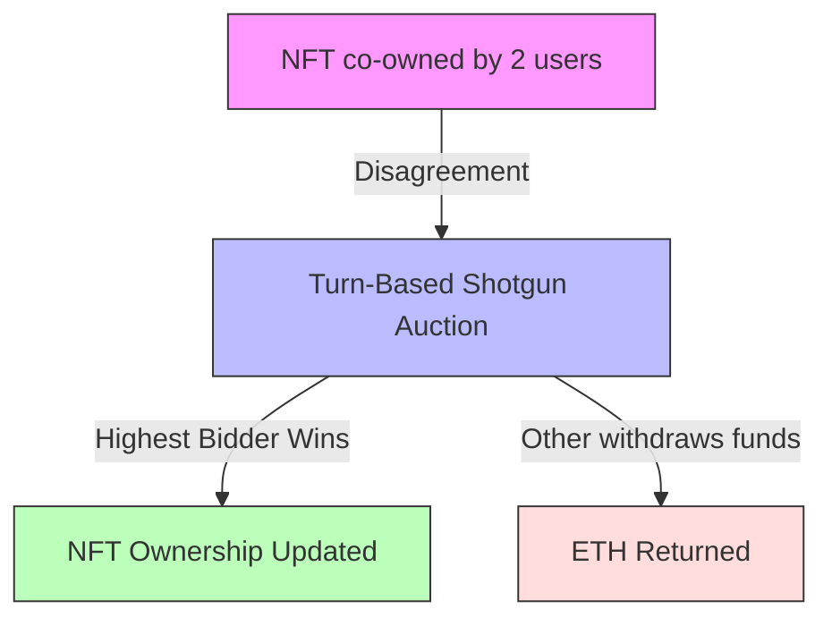
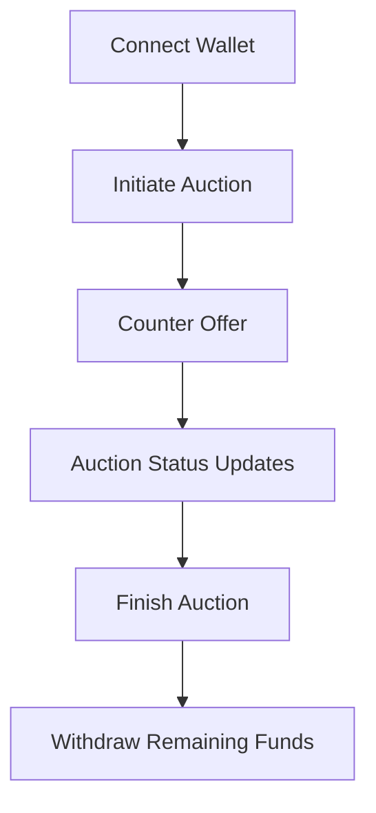

# Limited Bids Shotgun Auction

## Project Overview

Limited Bids Shotgun Auction is a smart-contract–powered mechanism designed to resolve shared NFT ownership disputes fairly and transparently. The contract implements a **Turn-Based Shotgun Auction** between two co-owners of a specific ERC-721 token, allowing them to submit offers with a strict limit on the number of counteroffers.

---

## Problem & Solution

**Problem:**  
Two users co-own an NFT and cannot agree on who should take full ownership.

**Solution:**  
A turn-based, limited-bid auction where each owner deposits half of their offer, submits counter-offers in alternating turns, and the highest bidder automatically receives the NFT.

### Problem & Solution Flowchart



---

## How It Works

1. **Initiate Auction:** One owner starts by calling `initiate()` and deposits half of their proposed price.  
2. **Counter Offers:** The other owner can make a higher offer using `counterOffer()`. Each counter-offer requires depositing half of the new price.  
3. **Turn-Based Bidding:** Only the opposite owner of the last bidder can submit the next bid.  
4. **Max Bids Limit:** The auction stops after reaching the maximum allowed bids (`maxBids`) or when the initiator finishes the auction.  
5. **Finish & Withdraw:** The highest bidder receives the NFT automatically. Each participant can withdraw their remaining ETH.

### Contract Flowchart

```mermaid
flowchart TD
    Start[NFT co-owned by 2 users] -->|Initiator calls initiate(), half deposit| Active[Auction Active]
    Active -->|Counter-offer by opposite owner| Update[Update currentPrice & highestBidder]
    Update -->|Repeat until maxBids reached or initiator finishes| Finished[Auction Finished]
    Finished -->|NFT transferred to highestBidder| Winner[NFT Ownership Updated]
    Finished -->|Other participant withdraws funds| Loser[ETH Returned]

    subgraph Rules
        TurnBased["Turn-Based: alternate bids only"]
        HalfDeposit["Each bid = 1/2 of offer"]
        MaxBidsLimit["Stop at maxBids"]
        TurnBased --> HalfDeposit --> MaxBidsLimit
    end
```

---

## Smart Contract Features

- Written in **Solidity 0.8.x**  
- Minimal **IERC721 interface**  
- State management: `Idle → Active → Finished`  
- Enforces authorized owners, turn-based bidding, higher bids only  
- Tracks each participant's ETH in a secure balance mapping  
- Fully compatible with **Next.js + Wagmi + Viem frontend**  
- Implements secure deposit handling and automatic NFT transfer  

---

## Frontend Overview

The frontend provides an interactive interface to:

- **Connect Wallet**: Owners connect their MetaMask wallet.  
- **Initiate Auction**: Start a new auction and deposit half of the price.  
- **Counter Offer**: Submit a higher bid on your turn.  
- **Finish Auction**: Finalize the auction, transferring the NFT to the highest bidder.  
- **Withdraw Funds**: Retrieve remaining ETH safely.

### Frontend Flowchart



---

## Demo Instructions

> **Note:** For demonstration, the same MetaMask wallet can be used to simulate both owners.

1. Connect the wallet.  
2. Start the auction as Owner A by setting a price and depositing half.  
3. Make a counter-offer as Owner B.  
4. Repeat turn-based bidding until the auction ends.  
5. Observe the highest bidder automatically receiving the NFT.  
6. Withdraw remaining ETH from the contract.

---

## Closing Summary

- Resolves NFT co-ownership disputes in a fair and transparent way.  
- Enforces turn-based bidding and secure deposits.  
- Transfers NFT automatically to the highest bidder.  
- Demonstrates practical smart contract concepts with a frontend for easy interaction.

---

## License

MIT License.

