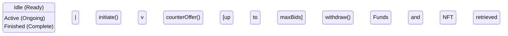

# LimitedBidsShotgun NFT Project

This project implements an Ethereum smart contract for managing an NFT using a **Limited Shotgun Auction** mechanism, along with a **MockNFT** contract for testing purposes. The README includes project structure, workflow, and instructions for deployment and testing.

---

## 🔹 Project Structure

```mermaid

.
├── contracts/
│   ├── LimitedBidsShotgun.sol   # Main Shotgun contract
│   └── MockNFT.sol              # Mock NFT for testing
├── test/
│   └── LimitedBidsShotgun.test.js # Unit tests
├── scripts/                     # Utility scripts
├── node_modules/                # npm packages (not uploaded)
├── artifacts/                   # Compiled contract files
├── cache/                       # Hardhat cache
├── hardhat.config.js            # Hardhat configuration
├── package.json                 # npm configuration
└── .gitignore                   # Git ignore rules

```

💡 **Note:** `node_modules` should not be pushed to GitHub.

---

## 🔹 Contract Overview

### 1. Purpose

The `LimitedBidsShotgun` contract allows two NFT owners to participate in a **limited-shotgun auction**:

- One owner starts as **Initiator** with a specified initial price.
- The second owner can respond with a **counter-offer**.
- The number of counter-offers is limited by `maxBids`.
- Once finished, the initiator receives the NFT, and both owners can withdraw their funds.

### 2. State Diagram



### 3. Key Functions

| Function | Input | Description | Notes |
|----------|-------|-------------|-------|
| `initiate(uint256 price)` | price | Start shotgun auction, deposit half of the price | Only owners can call |
| `counterOffer(uint256 newPrice)` | newPrice | Submit a higher counter-offer | Initiator cannot counter, limit by `maxBids` |
| `finish()` | - | End auction and transfer NFT to initiator | Only initiator can call |
| `withdraw()` | - | Withdraw funds after auction finishes | Cannot withdraw before finish |

---

## 🔹 Workflow Example

### Step 1: Deploy MockNFT

~~~~js
const NFT = await ethers.getContractFactory("MockNFT");
const nft = await NFT.deploy();
await nft.deployed();

const tokenId = await nft.mint(ownerA.address);
~~~~

### Step 2: Deploy LimitedBidsShotgun

~~~~js
const Shotgun = await ethers.getContractFactory("LimitedBidsShotgun");
const shotgun = await Shotgun.deploy(
  nft.address,
  tokenId,
  ownerA.address,
  ownerB.address,
  3
);
await shotgun.deployed();

// Transfer NFT to the contract
await nft.connect(ownerA).transferFrom(ownerA.address, shotgun.address, tokenId);
~~~~

### Step 3: Initiate Auction

~~~~js
await shotgun.connect(ownerA).initiate(
  ethers.utils.parseEther("2"), // total price 2 ETH
  { value: ethers.utils.parseEther("1") } // half of total price
);
~~~~

### Step 4: Counter Offer

~~~~js
await shotgun.connect(ownerB).counterOffer(
  ethers.utils.parseEther("3"), // new price 3 ETH
  { value: ethers.utils.parseEther("1.5") } // half of new price
);
~~~~

### Step 5: Finish Auction

~~~~js
await shotgun.connect(ownerA).finish();
~~~~

### Step 6: Withdraw Funds

~~~~js
await shotgun.connect(ownerA).withdraw();
await shotgun.connect(ownerB).withdraw();
~~~~

---

## 🔹 Testing Instructions

1. Install dependencies:

~~~~bash
npm install
~~~~

2. Compile contracts:

~~~~bash
npx hardhat compile
~~~~

3. Run tests:

~~~~bash
npx hardhat test
~~~~

💡 All core functionalities, limits, and error scenarios are covered in `LimitedBidsShotgun.test.js`.

---

## 🔹 Key Notes

- `LimitedBidsShotgun` demonstrates a **finite state machine** for NFT auction.
- Use `MockNFT` for safe testing and development.
- Always deposit exactly half of the price when initiating or counter-offering.
- ⚠️ The `withdraw()` function lacks `ReentrancyGuard` in this example; for production, always protect against reentrancy attacks.
- Test all workflows thoroughly before deploying to mainnet.


