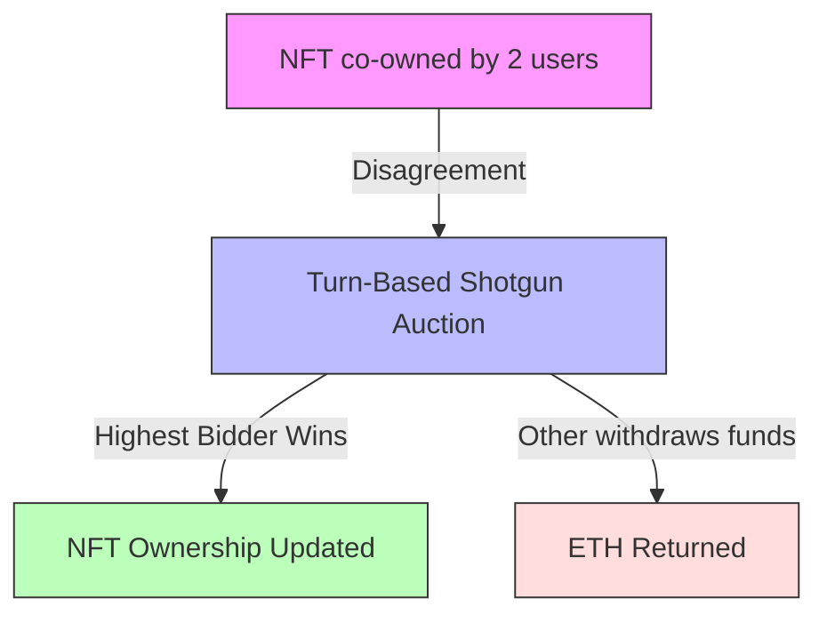
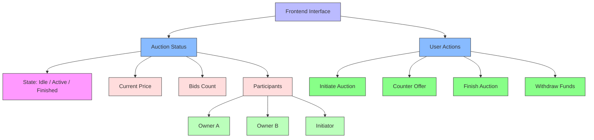
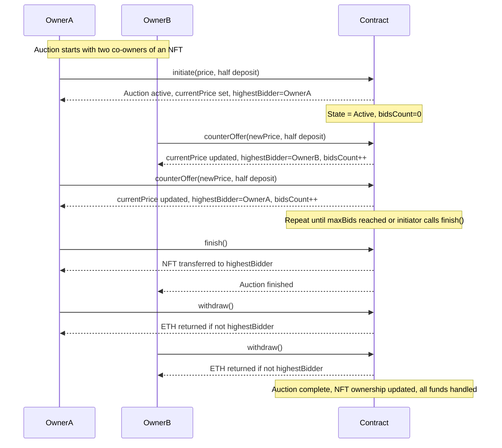

# 1 Limited Bids Shotgun Auction - Introduction Diagram

This diagram shows the basic idea of the project: resolving NFT co-ownership disputes via a turn-based shotgun auction.



---

# 2 Limited Bids Shotgun Auction - Contract & Frontend Structure

This diagram shows the main components of the LimitedBidsShotgun contract and the corresponding frontend actions for interacting with the auction.




---

# 2
# Limited Bids Shotgun Auction - Contract Flow

This sequence diagram shows the interaction between the two owners and the contract during a shotgun auction.




---

# 11

# Limited Bids Shotgun Auction - Contract Flow (Simplified)
# Limited Bids Shotgun Auction - Contract Flow (Simplified)

```mermaid
flowchart TD
    Start[NFT co-owned by OwnerA & OwnerB] --> Initiate[Owner initiates auction]
    Initiate --> Active[Auction Active: state=Active, currentPrice set, highestBidder=Initiator]
    
    subgraph Bidding_Loop
        direction TB
        OwnerB[OwnerB counterOffer] --> Active
        OwnerA[OwnerA counterOffer] --> Active
    end
    
    Active -->|maxBids reached or initiator finishes| Finish[finish() called]
    Finish --> NFTTransfer[NFT transferred to highestBidder]
    Finish --> Withdraw[Owners withdraw ETH]
    Withdraw --> End[Auction Complete]

    style Start fill:#f9f,stroke:#333,stroke-width:1px
    style Initiate fill:#8bf,stroke:#333,stroke-width:1px
    style Active fill:#bbf,stroke:#333,stroke-width:1px
    style Bidding_Loop fill:#def,stroke:#333,stroke-width:1px,stroke-dasharray: 5 5
    style Finish fill:#8f8,stroke:#333,stroke-width:1px
    style NFTTransfer fill:#bfb,stroke:#333,stroke-width:1px
    style Withdraw fill:#ffb,stroke:#333,stroke-width:1px
    style End fill:#fdd,stroke:#333,stroke-width:1px

```