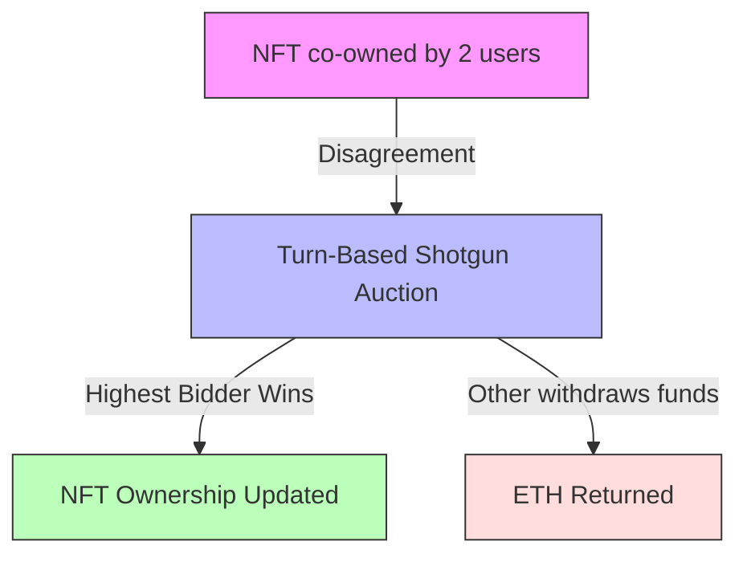
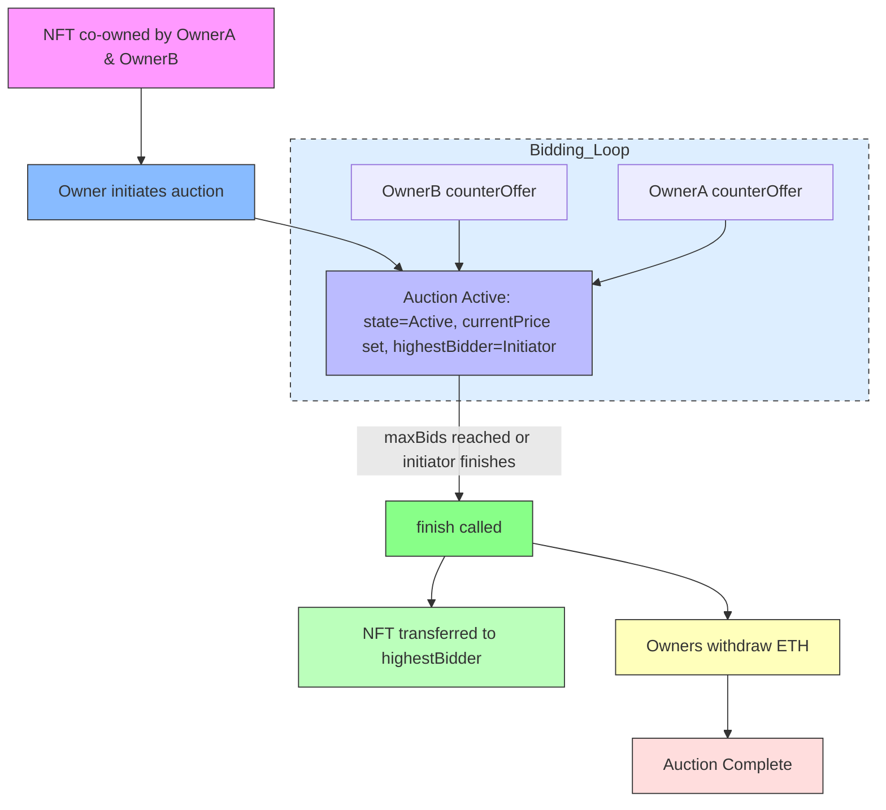

# 1 Limited Bids Shotgun Auction - Introduction Diagram

This diagram shows the basic idea of the project: resolving NFT co-ownership disputes via a turn-based shotgun auction.

---

# 2 Limited Bids Shotgun Auction - Contract Flow (Simplified)

